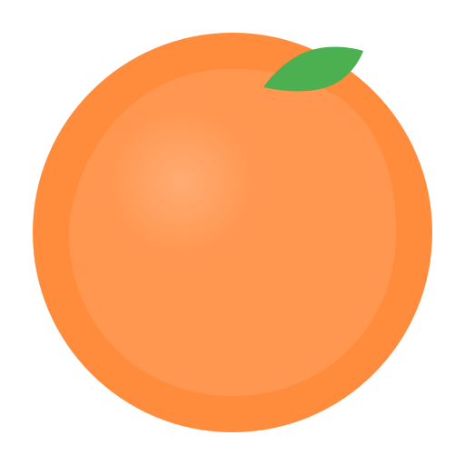

<div align="center">



# 橘子导航

**简洁优雅的视频资源聚合平台**

[](https://vuejs.org/)
[](https://www.typescriptlang.org/)
[](https://vitejs.dev/)
[](LICENSE)

[🌐 在线体验](https://v.qgming.com) · [🐛 问题反馈](https://github.com/qgming/orange/issues) · [➕ 提交网站](https://github.com/qgming/orange/issues)

</div>

## ✨ 特性

- 🎯 **资源丰富** - 收录 60+ 优质网站，涵盖影视、动漫、短剧、阅读等领域
- 🔍 **智能搜索** - 关键词搜索 + 标签筛选，毫秒级响应
- 📱 **响应式设计** - 完美适配桌面端、平板、移动设备
- 🎨 **现代 UI** - 液态玻璃设计系统，清爽简洁
- ⚡ **极速访问** - 无广告干扰，一键直达
- 🔒 **隐私保护** - 无需注册，不收集个人信息

## 🚀 快速开始

```bash
# 克隆项目
git clone https://github.com/qgming/orange.git

# 安装依赖
npm install

# 启动开发服务器
npm run dev

# 生产构建
npm run build
```

## 📦 技术栈

- **框架**: Vue 3.5 + TypeScript 5.7
- **构建**: Vite 7.3
- **路由**: Vue Router 4.5
- **状态**: Pinia 3.0
- **样式**: 原生 CSS + 设计系统

## 📂 项目结构

```
src/
├── assets/              # 静态资源
│   └── design-system/  # 设计系统
├── components/         # 组件
├── composables/        # 组合式函数
├── data/              # 数据配置
├── router/            # 路由
├── stores/            # 状态管理
├── types/             # 类型定义
├── utils/             # 工具函数
└── views/             # 页面
```

## 🤝 贡献

欢迎提交 Issue 和 Pull Request！

**添加新网站**: 编辑 [src/data/videoSites.ts](src/data/videoSites.ts)

```typescript
{
  name: "网站名称",
  url: "https://example.com",
  category: "影视",
  tags: ["标签1", "标签2"],
  isRecommended: true
}
```

## 📄 开源协议

[MIT](LICENSE) © [qgming](https://github.com/qgming)

---

<div align="center">

**如果觉得有帮助，请给个 ⭐️ Star 支持一下！**

</div>
